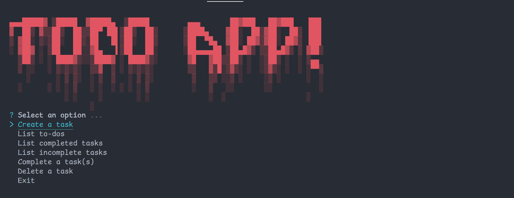

# Lista de tareas con node

##### introducción

Está aplicación es un CLI (**C**omand **L**ine **I**nterface), la cual fue construida con madulos externos gracias a [npmJs](http://npmjs.com) y programación asíncrona, la programación asincrona en resumidas palabras es la forma en la que JavaScript puede responder a otros eventos mientras una tarea de larga duración es realizada, se utilizó principalmente el modulo de [enquirer](https://www.npmjs.com/package/enquirer) para crear una intefaz por la cual solo se pueda manejar utilizando las flechas de navegación del teclado, para evitar que el usuario trate de acceder a opciones no contempladas, además de que este modulo de _npm_ trae alguna herramientas extra que facilitan la creacion de las opciones y validaciones.

### ¿Qué es mi producto y para que sirve?

Este producto esa una aplicación de tareas cuya interacción es a traves de la terminal, debido a que es una CLI, tiene como objetivo ser una herramienta para llevar un registro y control de las tareas del día a día de forma mas facil e intuitiva, debido al enfacis que se hizo en prestar una experiencia de usario optima.

### ¿Cuáles son las funcionalidades más importantes y por qué los usuarios las usarían?

Al ejecutar el comando `npm start` en la terminal, se desplegará el menú principal junto con un pequeño encabezado que indica que el usuario se encuentra en el menú principal. La interacción con el menú se realiza a través de las flechas de navegación del teclado y presionando **Enter** para acceder a la opción correspondiente. Cada opción muestra un encabezado para que el usuario tenga claridad sobre en qué parte de la aplicación se encuentra. Dependiendo de la opción seleccionada, la interacción varía:

- **Crear tarea**: Al ingresar a esta opción, el usuario debe escribir directamente la tarea a añadir, la cual debe tener más de 3 caracteres, y luego presionar Enter para confirmar la acción.

- **Eliminar y Marcar una tarea**: Estas dos opciones tienen la misma forma de interacción. Al ingresar a la opción, se mostrará un listado de las tareas (en caso de no existir ninguna tarea, se mostrará el mensaje correspondiente). El usuario puede seleccionar una o varias tareas para eliminarlas o marcarlas como completadas. Las tareas se seleccionan con la tecla espaciadora, y un indicativo a la izquierda de la descripción de la tarea indica que la tarea está seleccionada.
    - **Nota**: Si se selecciona una tarea marcada como completada, esta volverá a tener un estado de pendiente.

- **Listar tareas**: Las opciones para listar tareas, ya sean todas las tareas, las completadas o las incompletas, no tienen ningún tipo de interacción, ya que son opciones de solo lectura.

Mi producto ofrece una gran eficacia al momento de administrar las tareas diarias. Gracias a su variedad de opciones, permite cuantificar la productividad en función de la cantidad de objetivos que se tienen.
